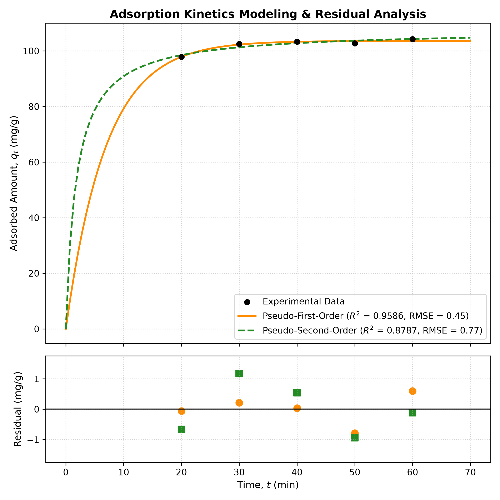
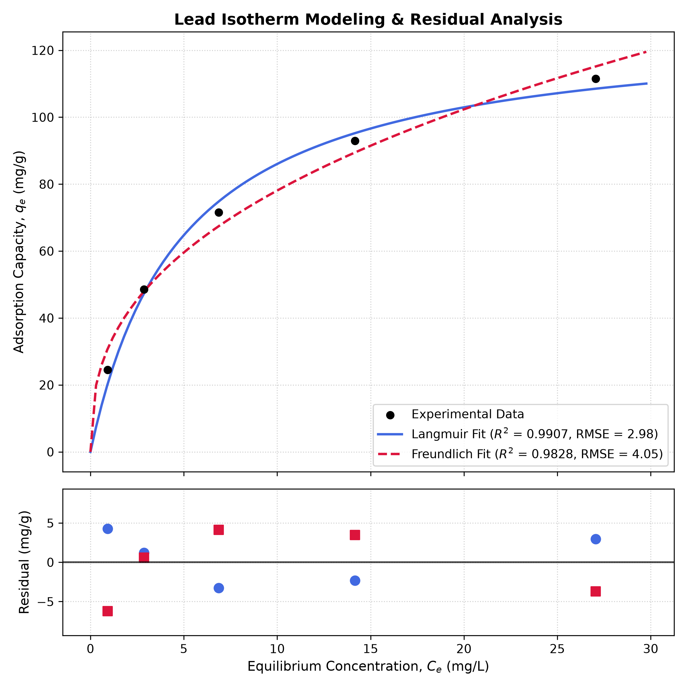
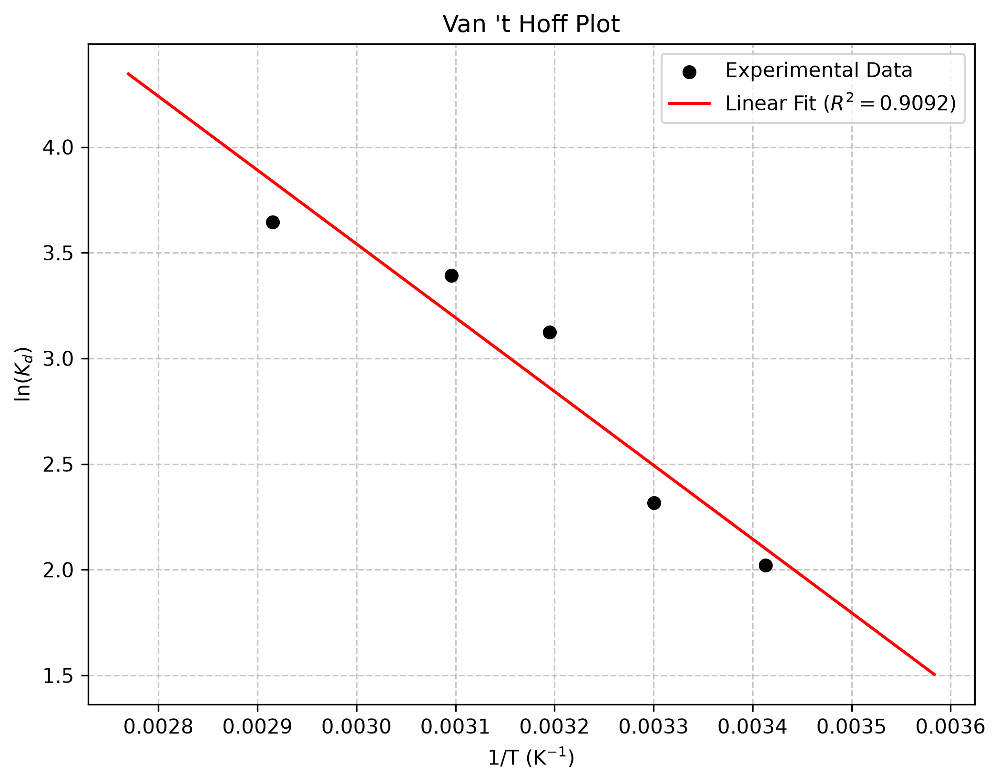

# heavy-metal-absorption-modeling

Overview of this project:- 

I started this project long after hearing a speech from an UNEP MUN conference, which talked about dumping toxic metals in water bodies. I really got curious and started researching, this helped me also find out that a lot of these concepts are already covered in my A and AS level syllabus. My research helped me engineer solutions through mathematical modeling for water purification. I used open source data from zenodo and mendeley. this project aims to analyze this data to figure out the actual physical mechanism, maximum capacity and the thermodynamic feasibility (spontaneous or non spontaneous) of using biochar ( which is produced by heated organic waste) to mitigate the effects of Pb(II) contamination in the water bodies.

Experiment Details: 

The entire planning from scientific design, mathematical strategies, data collection and organization and modification(which was quite difficult than I thought it would be) were all performed by me and to execute regressions an coding agent was used alongside an ADE.

1. Kinetic Analysis

I found there were two popular models, PFO(pseudo first order) and PSO (pseudo second order). generating a program to run a non linear regression to the concentration-time values helped me choose between the two models. The PFO model gave me an R squared value closer to one helping me conclude that the Pb(II) ions attached to the biochar through physical forces rather than chemical bonding which was suggested In the PSO model.

 2. Isothermal Analysis

The equilibrium data was plotted against the Langmuir(uniform surface for biochar) and freundlich(non uniform surface for biochar) isotherm models. The Langmuir model gave an R squared value of 0.9907 which helped me calculate the maximum adsorption capacity using the Langmuir equation which came out to be 128.16 mg/g meaning that a gram of biochar can offset about 128.16mg of lead ions per gram of biochar.

3. Thermodynamical Analysis:

I produced a  van ’t hoff graph using distribution coefficient through a variety of temperatures. Enthalpy was deduced through the slope of the graph and Entropy was found through the y intercept of the graph. 

**Van't hoff equation **:  $$\ln K_d = -\frac{\Delta H^\circ}{R}\left(\frac{1}{T}\right) + \frac{\Delta S^\circ}{R}$$

The values are
1. Standard Enthalpy Change:+29.02 Kj/mol
2. Standard Entropy Change:+116.53 J/mol/K
3. Gibbs free energy : -5.11 to -10.94 Kj/mol for the temperatures that was tested

The Gibbs free energy always remained negative indicating the process is spontaneous and because this is endothermic the efficiency of biochar is higher in warmer water bodies.

